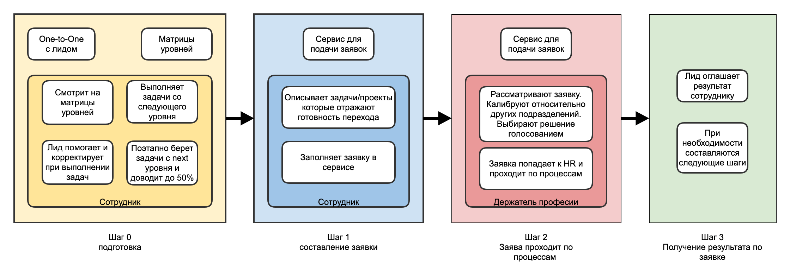

# Процесс повышение роли сотрудника

Тинькофф использует общий процесс для повышения роли сотрудника. Это позволяет понять инженеру, что ему нужно, чтобы повысить свою роль и какие у нас есть ожидания от роли инженера.

## Зачем появился Тинькофф рост

До появления этого фреймворка не было общедоступного процесса для руководителей/лидов которые бы включали текущие HR инструменты и практики по развитию сотрудников. Лиды команд тратили большое количество времени, чтобы разработать свою систему роста сотрудников и донести для всех. Как итог - в среднем лидам не хватало времени, а текущие готовые HR инструменты использовались мало. Тратилось время лидов и сотрудников, не давая взамен результата, поскольку инструменты использовались формально. Тинькофф рост был сделан для решения этих проблем, так и для того, чтобы сделать процесс прозрачным и понятным как для инженеров, так и лидов.

## Основные инструменты

- Матрицы уровней - описание наших ожиданий от роли сотрудника, при этом учитывая большой набор качеств, например - уровень влияние, сложность закрытых задач/проектов, коммуникации, дополнительные активности и множество других факторов
- One-to-One - в рамках этого процесса, позволяет помогать сотруднику с выполнением новых задач со следующего уровня, так и давать фидбек
- Сервис для подачи заявки - внутренний сервис в котором сотрудники могу сами оставить заявку на повышение
- Держатели профессии - группа инженеров которые ответственны за развитие стека внутри компании. Занимаются улучшением комьюнити, процессов собеседований, так и разбором заявок на повышения

## Процесс

### Шаг 0

0 шаг самый продолжительный в этом процессе, когда сотрудник постепенно прокачивается, выполняя необходимые требования с текущего уровня и со следующего уровня. При этом, у сотрудника остается возможность остановиться на своем уровне и не идти выше, все это происходит по желанию сотрудника

- Сотрудник вместе с лидом смотрят на матрицы уровней и вместе планируют необходимые задачи и активности
- Лид корректирует и помогает сотруднику выполнять задачи
- Происходит постепенный переход к следующей роли, без созданий стрессовых ситуаций когда резко прилетают все обязанности и требования от следующего уровня

Этот этап заканчивается, когда сотрудник уже выполняет 50%+ требований от следующего уровня и сам готов к повышению

### Шаг 1

Сотрудник составляет кейс по себе, где отражает задачи/проекты/активности которые показывают, что уже выполняется 50%+ от новой роли

- Сотрудник заходит в сервис заявок. Создает новую заявку на повышение роли. Описывает задачи/проекты/активности смотря на матрицу уровней и отправляет заявку на ревью лиду
- Лид ревьюит заявку на повышение, помогает улучшить оформление или добавляет дополнительных пунктов. И переводит заявку на следующий этап
- Собираются отзывы по заявке от других сотрудников

Этот этап заканчивается, когда заявка полностью оформлена и по ней собраны отзывы

### Шаг 2

Заявка переходит на этап, на котором рассматривается сама заявка, так и проводится по процессам

- Заявка попадает на держателей профессии, которые калибруют заявку относительно других направлений и нашего понимания, кто должен быть на определенном уровне
- Происходит голосование по заявке и выносится итоговое решение + пишется фидбек
- Заявка попадает к HRBP, которые проводят заявку по процессам, договориваются о изменениях и каждый квартал изменения вносятся в систему

### Шаг 3

Заявка уже имеет итоговый результат

- Решение приходит к руководителю, который может задать дополнительные вопросы
- Лид собирает встречу с сотрудником, при необходимости приглашая держателей профессии
- Результат оглашается сотруднику

